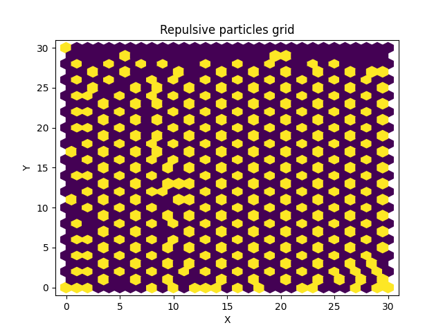
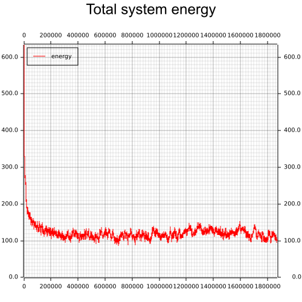
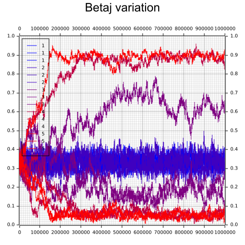

# Rust Simulation Program README


This README provides an overview of a Rust simulation program that utilizes hexagonal lattice models for simulating physical systems. The program includes functionality for running simulations, analyzing order parameters, and generating plots to visualize simulation results.

## Table of Contents

- [Introduction](#introduction)
- [Dependencies](#dependencies)
- [Usage](#usage)
- [Example](#example)
- [Modules](#modules)
- [Simulation](#simulation)
- [Plots](#plots)
- [Batch Runs](#batch-runs)
- [HexBoard](#hexboard)
- [Hex](#hex)

## Introduction

This Rust simulation program implements a hexagonal lattice model for simulating physical systems. It includes modules for plotting simulation data, running batch tests with varying parameters, and analyzing order parameters in the simulated system.

## Dependencies

The program relies on the following external crates:

- `rand`: A crate for random number generation.
- `plotters`: A crate for plotting data.

## Usage

To use the program, you need to have Rust installed on your system. You can build and run the simulation by executing the following commands in the terminal:
```cargo build ```
```cargo run```

This will compile and execute the simulation program.

## Example

After initializing the lattice with 1/3 fill rate and letting the system reach a local minimum we get the following results:

the particles order themselves as such:



We can see how the system evolved to a naturally lower energy state



And how the system reached one of 3 possible ordering base-states


We can even simulate multiple runs while varying the parameter of disorder of the system


## Modules

The program is organized into several modules:

- `plot`: Handles the plotting functionality using the `plotters` crate.
- `batchrun`: Contains batch running functionality to evaluate order with varying simulation parameters.
- `hexboard`: Implements the hexagonal lattice simulation board and related operations.

## Simulation

The `main` function initializes the simulation by creating a hexagonal lattice `HexBoard`, running the simulation loop, and generating plots to visualize the simulation results. The simulation loop advances the simulation using a repulsive algorithm until a certain condition is met.

## Plots

The `Plot` struct and its methods in the `plot` module are used to generate various types of plots, including time series and order parameter plots. These plots visualize the energy and order evolution of the simulated system.

## Batch Runs

The `Batchrun` struct in the `batchrun` module provides batch running functionality to perform multiple simulation runs with varying parameters. The module includes methods for running tests with different parameters, such as fill variation, betaj variation, and grid size variation.

## HexBoard

The `HexBoard` struct in the `hexboard` module represents the hexagonal lattice simulation board. It includes methods for initializing the lattice, calculating energy, advancing time steps, and calculating order parameters.

## Hex

The `Hex` struct in the `hexboard` module represents a hexagonal lattice cell. It stores the cell's position and value (occupied or unoccupied).
